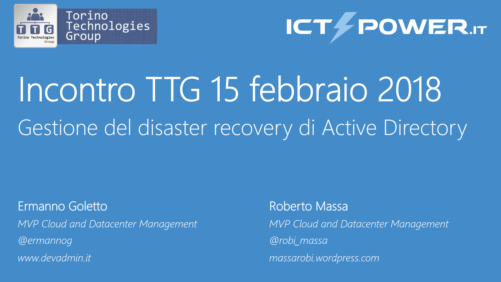

# Meetup TTG - ICTPower (15 feb 2018 Torino)

__Abstract:__

*Active Directory rappresenta il cuore delle moderne infrastrutture Windows basate su sistemi operativi Windows. L'obbiettivo della sessione è quella di fornire una descrizione dettagliata dei componenti di Active Directory e del loro impatto sul sistema in caso di malfunzionamento. Inoltre verranno approfondite le Best Practices e gli strumenti a disposizione nelle varie versioni di Windows Server per eseguire il troubleshooting e il disaster recovery di Active Directory.*

__Slide:__

[Public Key Infrastructure Windows e Let's Encrypt.pdf](Public%20Key%20Infrastructure%20Windows%20e%20Let's%20Encrypt.pdf){:target="_blank"}

__Video:__ 

{:target="_blank"}
