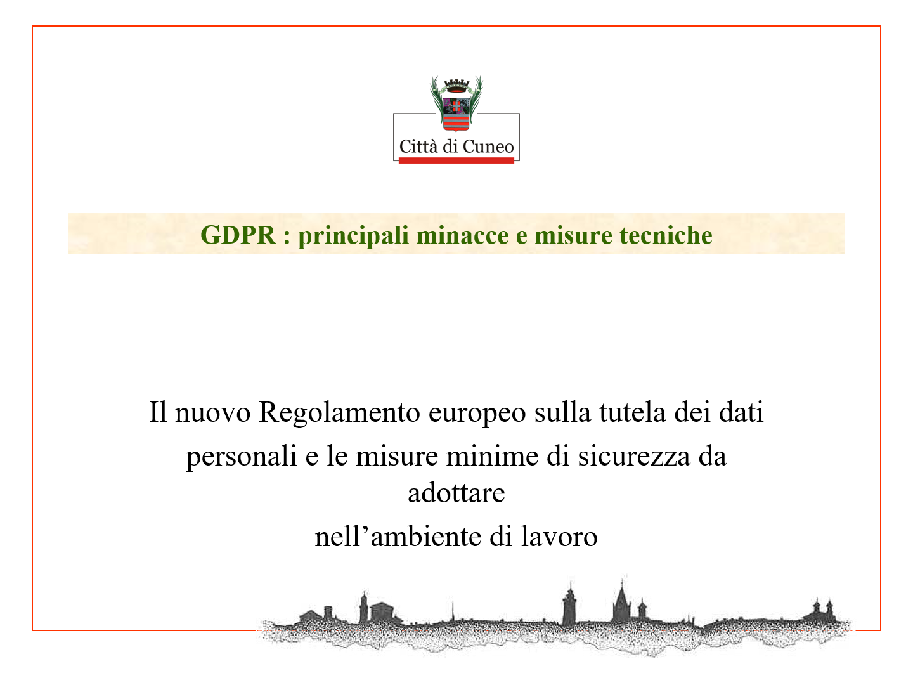

# Corso Comune di Cuneo (10 dec 2018 Cuneo)

__Abstract:__

*Analisi delle misure minime di sicurezza informatica che devono essere adottate al fine di contrastare le minacce più comuni e frequenti per le pubbliche amministrazioni.*

__Slide:__ [GDPR principali minacce e misure tecniche.pptx](GDPR%20%20principali%20minacce%20e%20misure%20tecniche.pptx)

__Documenti:__ 
* [Gazzetta Ufficiale Anno 158 Numero 103](GU-158-103.pdf){:target="_blank"}
* [Rapporto_Clusit_2018_aggiornamento_settembre](Rapporto_Clusit_2018_aggiornamento_settembre.pdf){:target="_blank"}
