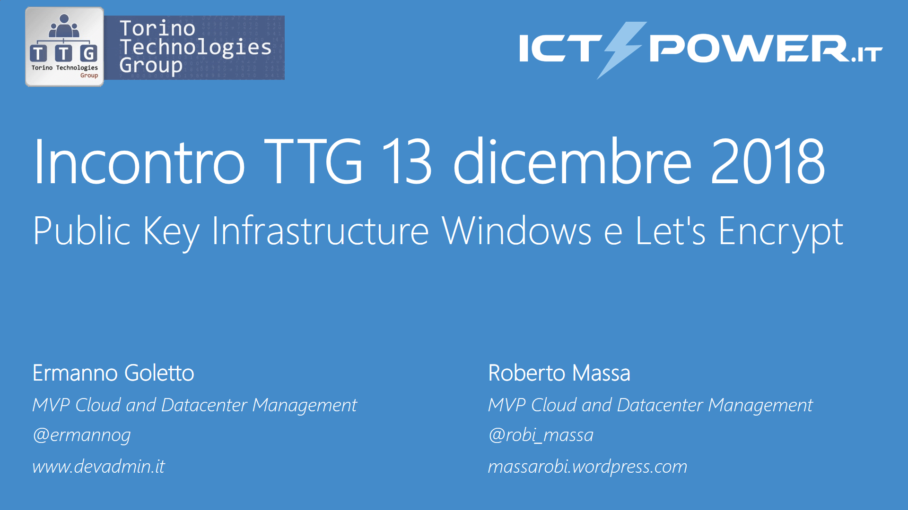

# Meetup TTG - ICTPower (13 dec 2018 Torino)

__Abstract:__

*Nelle moderne infrastrutture informatiche la gestione dei certificati digitali è una delle attività che stanno alla base di una corretta politica della sicurezza informatica. Nella prima parte della sessione verrano analizzati le architetture di installazione di una Cerification Autority in ambiente Windows Sever per piccole, medie e grandi aziende e saranno discusse le best practices di gestione della Security e del Backup di una CA. Nella seconda parte dell sessione verrà invece approfondito come utilizzare la Certification Authority Pubblica gratuita Lets'encrypt per la gestione automatizzata del ciclo di vita dei certificati digitali.*

__Slide:__ [Public Key Infrastructure Windows e Let's Encrypt.pdf](Public%20Key%20Infrastructure%20Windows%20e%20Let's%20Encrypt.pdf){:target="_blank"}

__Video:__ 

{:target="_blank"}

