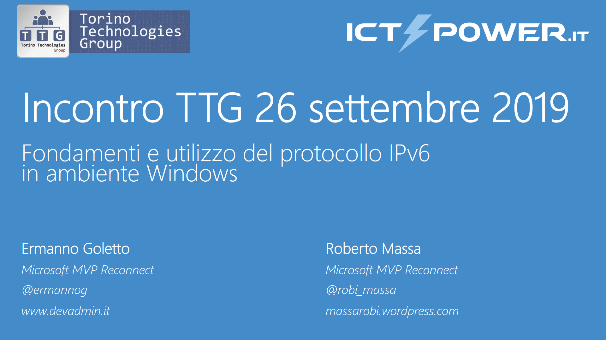

# Meetup TTG - ICTPower (26 set 2019 Torino)

__Abstract:__

*La diffusione di Internet e il proliferare dei dispositivi connessi (smartphone, tablet, smartwatch) hanno portato alla luce i limiti dell’IPv4 costringendo provider e organizzazioni ad adottare nel prossimo futuro una nuova versione dell’Internet Protocol denominata IPv6. Nella sessione approfondiremo i fondamenti e le funzionalità dell'IPv6 dal punto di vista dell'ammistratore di sistema esaminando quali sono i passi da seguire per la sua adozione valutando sia i vantaggi che le problematiche da affrontare.*

__Slide:__

[Fondamenti e utilizzo del protocollo IPv6 in ambiente Windows.pdf](Fondamenti%20e%20utilizzo%20del%20protocollo%20IPv6%20in%20ambiente%20Windows.pdf){:target="_blank"}

__Video:__ 

