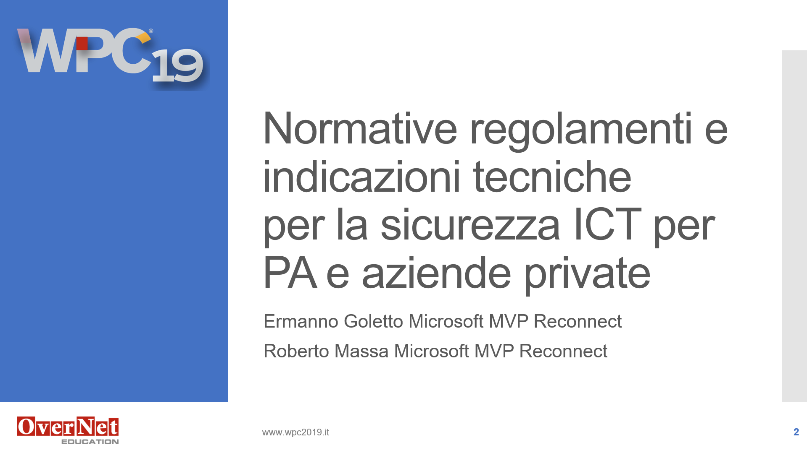

# Wpc 2019 (5 Dicembre 2019 Milano)

__Abstract:__

*Per raggiungere la compliance degli articoli 25 e 32 del GDPR relativi alla protezione dei dati e la sicurezza del trattamento occorre mettere in atto misure tecniche e organizzative adeguate a garantire la sicurezza dei dati personali. In questa sessione verranno analizzate le indicazioni tecniche che possono guidare aziende private, pubbliche amministrazioni e fornitori di servizi per intraprendere una percorso volto alla cybersecurity e alla protezione dei dati coerente con i regolamenti stessi. In particolare verranno analizzati il Framework Nazionale per la Cybersecurity e la Data Protection, le Misure minime di sicurezza ICT per le pubbliche amministrazioni e il Codice dell'Amministrazione Digitale e come possono essere impiegati per l'adeguamento al GDPR, alla direttiva NIS e al Cybersecurity Act.*

__Slide:__

[WPC076_slides.pdf](WPC076_slides.pdf){:target="_blank"}
